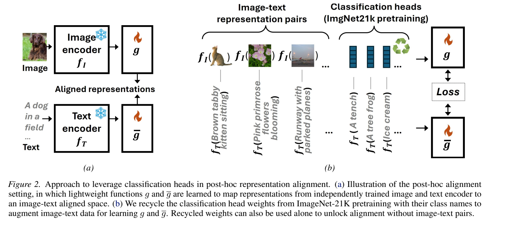

# Supervised Classification Heads as Semantic Prototypes

Official implementation for the article **"Supervised Classification Heads as Semantic Prototypes: Unlocking Vision-Language Alignment via Weight Recycling"**
ICML 2026 [[arXiv](https://arxiv.org/abs/2605.22484)].
Project page: [Recycling4VLAlignment](https://david-mnd.github.io/recycling4vlalignment/).

This repository is a clean reproducibility release derived from the research workspace used for the paper.



## Abstract

Vision-Language Models (VLMs) excel at tasks like zero-shot classification and
cross-modal retrieval by mapping images and text to a shared space, but this
requires expensive end-to-end training with massive paired datasets. Current
post-hoc alignment methods reduce computational costs by connecting pretrained
encoders through lightweight mappings, yet still demand substantial paired data.
In this work, we investigate the potential of repurposing the classification
heads of pretrained vision models as semantic prototypes. The recycling of these
weights, typically discarded after pretraining, unlocks two distinct
capabilities: it enables zero-shot alignment by using weights as semantic
anchors, and serves as a robust data augmentation strategy by mixing these
prototypes with real image-text pairs. We demonstrate that integrating our
approach with several state-of-the-art post-hoc alignment techniques
consistently boosts accuracy in cross-modal retrieval, zero- and few-shot
classification tasks.

## Repository Layout

```text
classification_and_retrieval.py   Main experiment CLI
alignment/                        Alignment models and training code
config/                           Model, dataset, and path configuration
dataloaders/                      Dataset loading utilities
evaluation/                       Classification and retrieval evaluation
utils/                            Model, text, data, and helper utilities
analyses/                         Selected paper analysis scripts
other_methods/csa/                Minimal CCA dependency used by the paper code
data/                             Small label/split metadata only
assets/                           README figures and lightweight public assets
paper/                            Local ignored PDF staging directory
```

## Setup

Create the environment with Conda:

```bash
conda env create -f environment.yml
conda activate recycling4vlalignment
```

The code downloads public torchvision datasets when possible. Large datasets,
model weights, cached embeddings, and checkpoints are intentionally not tracked
in Git.

## Local Paths

By default, paths are repo-relative:

- data: `./data`
- model weights: `./weights`
- embeddings: `./data/embeddings`
- aligner checkpoints: `./aligner_checkpoints`

You can override these paths:

```bash
export RECYCLING4VLALIGNMENT_DATA_DIR=/path/to/data
export RECYCLING4VLALIGNMENT_WEIGHTS_DIR=/path/to/weights
export RECYCLING4VLALIGNMENT_EMBEDDINGS_DIR=/path/to/embeddings
export RECYCLING4VLALIGNMENT_CHECKPOINT_DIR=/path/to/checkpoints
```

## Example

Run zero-shot DTD classification with MLP alignment:

```bash
python classification_and_retrieval.py \
  --image_models "timm/beit_base_patch16_224.in22k_ft_in22k" \
  --text_models "clip_vitb32" \
  --task classification \
  --mode MLP \
  --datasets dtd \
  --seed 42
```

## Paper Reproduction

The main CLI supports the paper's classification and retrieval experiments:

- `--task classification` or `--task retrieval`
- `--mode MLP`, `--mode CCA`, or `--mode text2concepts`
- `--sequential_training` for few-shot sequential training
- `--dataset_img_repr` and `--few_shot_samples` for image-representation and few-shot settings

For full-scale reproduction, make sure the required datasets and cached model
weights are available through the path variables above.

## Extra Analysis

The selected analysis scripts include Mutual K-NN alignment checks for comparing
semantic neighborhood preservation between visual and textual representations.

## Citation

If you use this repository, please cite the ICML 2026 paper:

```bibtex
@inproceedings{mendez2026supervised,
  title = {Supervised Classification Heads as Semantic Prototypes: Unlocking Vision-Language Alignment via Weight Recycling},
  author = {Mendez, David and Confalonieri, Roberto and Diaz-Rodriguez, Natalia},
  booktitle = {Proceedings of the International Conference on Machine Learning (ICML)},
  year = {2026},
  archivePrefix = {arXiv},
  eprint = {2605.22484},
  primaryClass = {cs.CV},
  url = {https://arxiv.org/abs/2605.22484}
}
```
